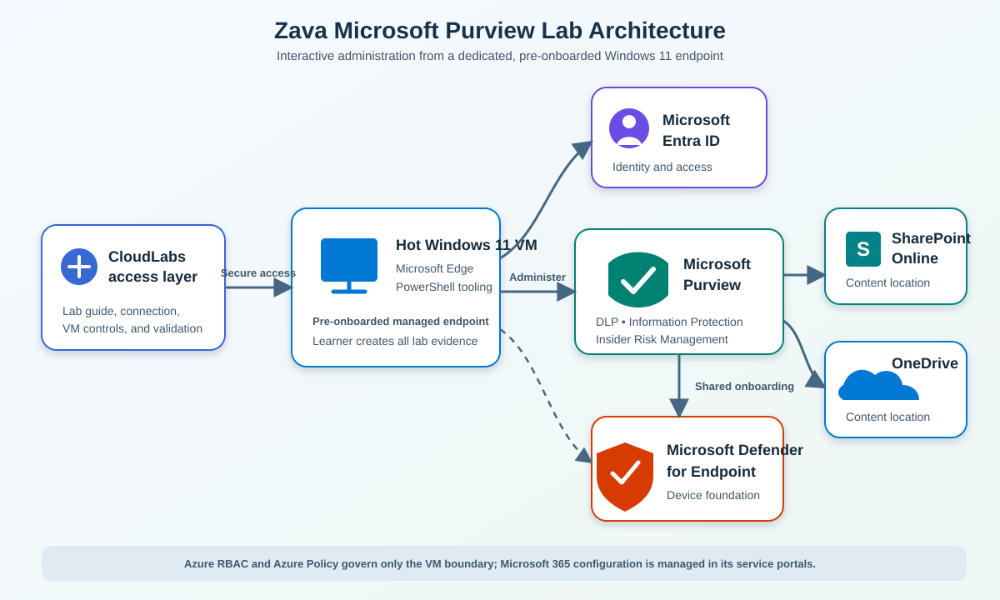

# Getting Started: Know Your Data — Discover, Classify and Protect Sensitive Information with Microsoft Purview

### Overall Estimated Duration: 6 Hours

## Objectives

After completing this introduction, you will be able to:

- Confirm that your assigned account has the Microsoft 365 E5 license required by the lab.
- Identify the Microsoft Purview, Microsoft 365, and Windows 11 components used in the solution.
- Access the dedicated Windows 11 lab VM and use the CloudLabs interface.
- Sign in to the Microsoft Purview portal with the provided learner identity.
- Recognize which lab assets you must create and which endpoint prerequisites the lab operator has already completed.

## Prerequisites

1. From the Windows 11 lab VM, open Microsoft Edge and browse to <https://portal.office.com/account/#subscriptions>.
2. Sign in when prompted with the assigned lab account:
   - **Username:** <inject key="AzureAdUserEmail"></inject>
   - **Temporary Access Pass:** <inject key="AzureAdUserPassword"></inject>
3. On **Subscriptions**, positively verify that **Microsoft 365 E5** appears for your account.

> [!IMPORTANT]
> If **Microsoft 365 E5** is absent, stop immediately and contact the lab operator by using the support details later on this page. Do not continue: missing licensing can produce misleading symptoms in Microsoft Purview.

4. Confirm that you can use the dedicated Windows 11 VM and Microsoft Edge. Edge is the required browser for validation and endpoint testing. Chrome and Firefox can be used for supported endpoint actions only when the Microsoft Purview extension is installed.
5. Keep the supplied Temporary Access Pass private. Use it only for interactive sign-in when requested. Never place it in a script, file, log, command history, or noninteractive credential object.
6. Be aware that the operator prepared the hot instance at least 24 hours before delivery. The operator assigned Microsoft 365 E5, completed Microsoft Defender for Endpoint tenant provisioning, assigned Global Administrator and the required Microsoft Purview role groups, and onboarded the VM to Microsoft Purview.
7. The required Microsoft Purview role-group assignments are `Information Protection`, `Content Explorer List Viewer`, `Content Explorer Content Viewer`, `Insider Risk Management`, and `Compliance Administrator`.

> [!IMPORTANT]
> Nothing used as learner evidence is pre-seeded. There are **no sample documents**, **no sensitivity labels**, **no completed simulation results**, **no HR connector data**, and **no existing insider-risk alerts**. **Security Copilot is not provisioned and is not required.** You will generate all evidence during the lab.

## Architecture

The lab combines a Microsoft 365 E5 tenant with a dedicated Azure-hosted Windows 11 endpoint. You work interactively from that endpoint with Microsoft Purview, Microsoft Entra ID, SharePoint Online, OneDrive, Security & Compliance PowerShell, and Microsoft Graph PowerShell. Azure deployment controls apply only to the VM and its Azure resource boundary; they do not provision or govern Microsoft 365 licenses, Microsoft Purview role groups, Defender tenant readiness, or Purview policies.

The operator has already onboarded the endpoint. In Challenge 3, you verify its state in Microsoft Purview at **Settings** > **Device onboarding** > **Device report** and **Settings** > **Device onboarding** > **Devices**. Current Microsoft guidance identifies the device report as the view for onboarding, recent connectivity, policy-update readiness, and supported-feature readiness. The device list exposes **Configuration status** and **Policy Sync status**. If the assigned VM is unhealthy, stale, not onboarded, or not ready to receive policy updates, stop and contact the lab operator; do not attempt onboarding or remediation.

## Architecture diagram

## Explanation of components

| Component | Purpose in this lab |
|---|---|
| Windows 11 lab VM | Dedicated managed endpoint from which you perform administration, create synthetic evidence, and test Endpoint DLP controls. |
| Microsoft Edge | Required validation browser. It supports the tested endpoint actions natively. |
| Microsoft Purview portal | Unified portal at <https://purview.microsoft.com> for Data Loss Prevention, Information Protection, device onboarding health, Activity explorer, and Insider Risk Management. |
| Microsoft Entra ID | Supplies the learner identity and the account-deleted triggering event used by the departing-user insider-risk policy. |
| SharePoint Online and OneDrive | Hold learner-created synthetic documents for discovery, DLP simulation, and service-side auto-labeling simulation. |
| Security & Compliance PowerShell | Supports positive verification of audit and Microsoft Purview configuration where supported. |
| Microsoft Graph PowerShell | Supports verification and configuration of the directory setting for sensitivity labels on Microsoft 365 groups and sites. |
| Microsoft Defender for Endpoint | Provides the tenant and endpoint foundation shared with Microsoft Purview device onboarding. Provisioning is an operator prerequisite. |
| Azure resource boundary | Contains the Windows 11 VM, network interface, virtual network, network security group, access path, managed disk, and diagnostics. Azure RBAC and Azure Policy apply only to these Azure resources. |

## Getting started with the lab

This is a six-hour, intermediate challenge lab for Zava, a growing business that needs to identify regulated data, classify it consistently, prevent endpoint exfiltration, and detect risk from departing users.

You will complete four challenges:

1. **Discover sensitive data:** create the synthetic documents `Zava-Customer-Payments.docx`, `Zava-Employee-Records.docx`, and `Zava-Mixed-Sensitive-Data.docx`; then configure `Zava Discovery Baseline` with `Zava Discovery Sensitive Data Rule` in simulation mode.
2. **Classify with labels and auto-labeling:** create `Zava Public`, `Zava Internal`, `Zava Confidential`, and `Zava Highly Confidential`; publish them through `Zava Global Label Policy`; and configure `Zava Auto-Label Policy` with `Zava High-Risk Identity Data Rule` in simulation mode.
3. **Protect the endpoint:** configure `Zava Block Removable Storage`, `Zava Block Unsanctioned Cloud Uploads`, and `Zava Block Generative AI Sharing`; then test with `Zava-Endpoint-Sensitive-Data.txt` in Microsoft Edge.
4. **Detect departing-user risk:** configure `Zava Departing Employee Data Theft`, complete a guided portal cross-check, and then record seven Azure VM evidence tags on the VM resolved by DeploymentID: `ZavaIRPolicy`, `ZavaIRTemplate`, `ZavaIRPolicyType`, `ZavaIRTrigger`, `ZavaIRPriorityPages`, `ZavaIRIndicators`, and `ZavaIREvidenceUtc`.

The six-hour booking includes **255 minutes of active work** across Getting Started and the four challenges, plus this concrete **105-minute operating allowance**:

- **30 minutes** for breaks.
- **20 minutes** for operator checkpoints covering licensing, access, role propagation, and pre-onboarded device health.
- **40 minutes** for policy synchronization allowance while you continue with work that does not depend on delayed results.
- **15 minutes** for final configuration and evidence review.

The operating allowance is part of the booking, not additional graded work. Policy synchronization or delayed telemetry does not become a pass criterion; use the allowance for another listed activity or final review when synchronization completes sooner.

Simulation results, Content Explorer counts, label propagation, Activity explorer arrival, and insider-risk alert generation can be delayed. Unless a challenge explicitly asks you to observe them, delayed results are not pass criteria.

## Accessing your lab environment

1. In the CloudLabs lab page, locate the connection controls for your provisioned virtual machine.
2. Note the deployment identifier shown for **Zava lab deployment <inject key="DeploymentID" enableCopy="false"/>**. Use this value whenever the lab interface asks you to identify your deployment.
3. Start the VM if its status is stopped, and wait until the status reports that it is running.
4. Select the available connection option and follow the CloudLabs prompts to open the Windows 11 desktop.
5. Keep the CloudLabs browser tab open so you can return to the guide, VM controls, support, and validation actions.

## Virtual machine and lab guide

1. Use the Windows 11 VM for every portal, PowerShell, document, and endpoint action in the lab.
2. Keep Microsoft Edge open beside the lab guide. Do not move tenant secrets into local text files or terminal transcripts.
3. Complete challenge steps in order. Later configurations depend on objects and evidence that you create earlier.
4. Use only the exact names printed in the guide. Do not add suffixes, choose alternatives, or rename objects.
5. When a challenge contains a validation control, run it only after completing all tasks in that challenge. Validators check immediate configuration state; they do not use delayed simulation or telemetry as pass criteria.

## Exploring your lab resources

1. On the VM, open **Start**, search for **Windows PowerShell**, and confirm that the terminal opens.
2. In PowerShell, run `hostname` and record the displayed computer name for use when locating the device in Microsoft Purview.
3. Open File Explorer and review the local evidence and synthetic-data helper folders prepared by the bootstrap process. These folders contain helper files and empty evidence locations, not completed learner evidence or sample documents.
4. Open Microsoft Edge and confirm that <https://purview.microsoft.com> is reachable. Do not create any configuration yet.
5. Remember that Microsoft 365 control-plane objects do not appear as Azure resources. The Azure resource group contains the VM boundary only; your Microsoft Purview policies, labels, SharePoint content, and OneDrive content are managed in their respective Microsoft 365 services.

## Using the split window feature

1. In the CloudLabs interface, select the split-window control when you want to view the guide and remote desktop together.
2. Place the guide on one side and the VM session on the other.
3. Adjust the divider until portal labels and numbered instructions remain readable.
4. If keyboard input goes to the wrong pane, select inside the remote desktop before typing.

## Managing your virtual machine

1. Use the CloudLabs VM controls to start, stop, or restart the VM only when instructed or when the remote session is unresponsive.
2. Before a restart, save open documents and close active PowerShell operations.
3. Do not redeploy, delete, reimage, offboard, or manually onboard the VM.
4. If Microsoft Purview reports unhealthy onboarding, stale connectivity, configuration problems, or lack of readiness for Endpoint DLP policy updates, stop and contact the lab operator. Endpoint onboarding and remediation are outside the learner workflow.
5. A newly created Endpoint DLP policy can require synchronization time even when the endpoint is healthy. Do not treat delayed policy tips or Activity explorer events as proof that the device is unhealthy.

## Zoom options

1. Use the browser's **Settings and more** menu to zoom Microsoft Edge pages, or press **Ctrl**+**+** and **Ctrl**+**-**.
2. Use **Ctrl**+**0** to return the browser to 100 percent.
3. Use the CloudLabs display or scaling control for the remote desktop when available.
4. Avoid browser zoom levels that hide Microsoft Purview navigation or wizard controls; reduce zoom temporarily if a command is not visible.

## Getting started with the portal

1. On the Windows 11 VM, open Microsoft Edge and go to <https://purview.microsoft.com>.
2. Sign in with <inject key="AzureAdUserEmail"></inject> and the provided Temporary Access Pass when prompted.
3. If the first-run welcome dialog appears, review the terms, select **Get started**, and dismiss or follow the teaching prompts.
4. Confirm that the home page displays the Microsoft Purview solutions available through your subscription and permissions. Select **View all solutions** when a required solution card is not on the home page.
5. Locate **Data Loss Prevention**, **Information Protection**, and **Insider Risk Management**. The exact cards visible depend on subscription and permissions; if any required solution remains unavailable after refresh and sign-in verification, contact the lab operator.
6. Locate **Settings** in the global left navigation or top command bar. In Challenge 3, use **Settings** > **Device onboarding** > **Device report** to review health and **Settings** > **Device onboarding** > **Devices** to inspect the assigned VM's configuration and policy-sync details.

## Support contact

If licensing, access, role propagation, VM connectivity, or pre-onboarded device health prevents progress, stop and contact CloudLabs support:

- Email: [cloudlabs-support@spektrasystems.com](mailto:cloudlabs-support@spektrasystems.com)
- Support portal: <https://cloudlabs.ai/labs-support>

Include your lab title, the deployment identifier for **Zava lab deployment <inject key="DeploymentID" enableCopy="false"/>**, the affected portal or VM, and a non-secret description of the error. Never include the Temporary Access Pass, tokens, document contents, or other secrets.

## Reference links

- [Learn about the Microsoft Purview portal](https://learn.microsoft.com/purview/purview-portal)
- [Microsoft Purview permissions](https://learn.microsoft.com/purview/purview-permissions)
- [Monitor device health with the device health reports dashboard](https://learn.microsoft.com/purview/device-onboarding-health-reports-dashboard)
- [Onboard Windows devices into Microsoft 365 overview](https://learn.microsoft.com/purview/device-onboarding-overview)
- [Get started with Endpoint data loss prevention](https://learn.microsoft.com/purview/endpoint-dlp-getting-started)
- [Understand subscriptions and licenses in Microsoft 365 for business](https://learn.microsoft.com/microsoft-365/commerce/licenses/subscriptions-and-licenses?view=o365-worldwide)

## Happy Learning!

Proceed to Challenge 1 when the Microsoft 365 E5 license check, VM access, and Microsoft Purview portal access are successful.
